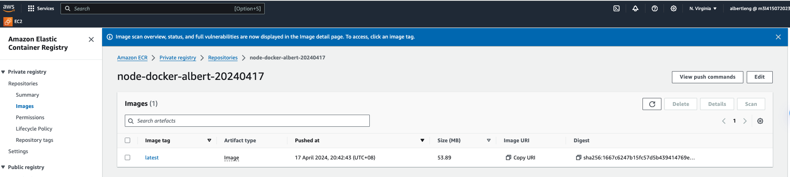

# First Node Application

## Description

This is my first node application. It is a simple application that demonstrates
basic commands of Node and NPM.

## Installation

First initialize npm in your project. This will create a `package.json` file for
managing dependencies.

```bash
npm init
```

Then, install the project dependencies:

```bash
npm install
```

## Steps to create a Docker image and deploy to AWS ECR

1. **Build the Docker image**

```bash
docker build -t node-docker-albert-20240417 .
```

2. **Create a repository in AWS ECR**

```bash
aws ecr create-repository --repository-name node-docker-albert-20240417
```

3. **Authenticate Docker to your ECR repository**

```bash
aws ecr get-login-password --region us-east-1 | docker login --username AWS --password-stdin 255945442255.dkr.ecr.us-east-1.amazonaws.com
```

4. **Tag the Docker image**

```bash
docker tag node-docker-albert-20240417:latest 255945442255.dkr.ecr.us-east-1.amazonaws.com/node-docker-albert-20240417:latest
```

5. **Push the Docker image to AWS ECR repo**

```bash
docker push 255945442255.dkr.ecr.us-east-1.amazonaws.com/node-docker-albert-20240417:latest
```

## Screenshots

  
  


## Contributing

Pull requests are welcome. For major changes, please open an issue first to
discuss what you would like to change.

## License

[MIT](https://choosealicense.com/licenses/mit/)